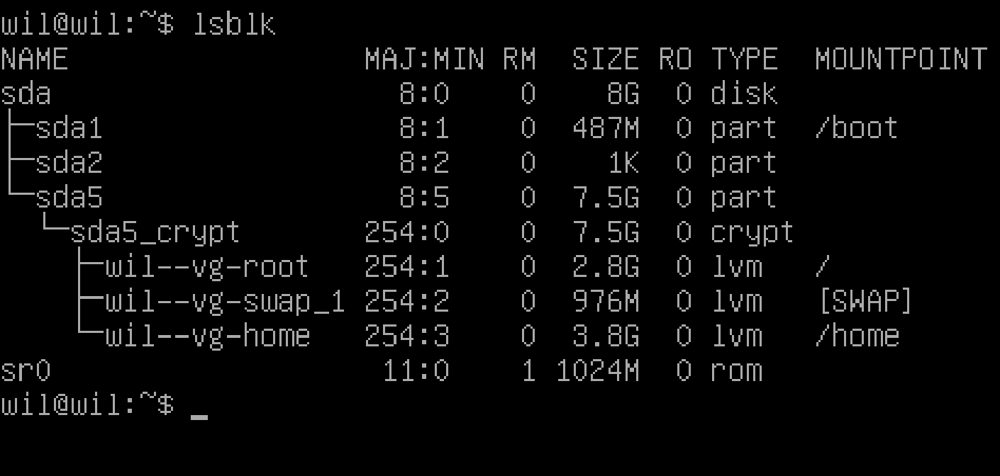

# Born2beRoot

## Chapter Ⅰ - Preamble

YOU CAN DO ANYTHING YOU WANT TO DO
VIRTUAL MACHINE
THIS IS YOUR WORLD

## Chapter Ⅱ - introduction

This project aims to introduce you to the wonderful world of virtualization.
You will create your first machine in VirtualBox (or UTM if you can’t use VirtualBox) under specific instructions. Then, at the end of this project, you will be able to set up your own operating system while implementing strict rules.

## Chapter Ⅲ - General guidelines

- The use of VirtualBox (or UTM if you can’t use VirtualBox) is mandatory.
- You only have to turn in a signature.txt file at the root of your repository. You must paste in it the signature of your machine’s virtual disk. Go to Submission and peer-evaluation for more information

## Chapter Ⅳ - Mandatory part

1. This project consists of having you set up your first server by following specific rules
2. Since it is a matter of setting up a server, you will install the minimum of services. For this reason, a graphical interface is of no use here. It is therefore forbidden to install X.org or any other equivalent graphics server. Otherwise, your grade will be 0.
3. You must choose as an operating system either the latest stable version of Debian (no testing/unstable), or the latest stable version of Rocky. Debian is highly recommended if you are new to system administration.
4. Setting up Rocky is quite complex. Therefore, you don’t have to set up KDump. However, SELinux must be running at startup and its configuration has to be adapted for the project’s needs. AppArmor for Debian must be running at startup too.
5. You must create at least 2 encrypted partitions using LVM. Below is an example of the expected partitioning:
6. During the defense, you will be asked a few questions about the operating system you chose. For instance, you should know the differences between aptitude and apt, or what SELinux or AppArmor is. In short, understand what you use!
7. A SSH service will be running on the mandatory port 4242 in your virtual machine. For security reasons, it must not be possible to connect using SSH as root.
8. The use of SSH will be tested during the defense by setting up a new account. You must therefore understand how it works.
9. You have to configure your operating system with the UFW (or firewalld for Rocky) firewall and thus leave only port 4242 open in your virtual machine.
10. Your firewall must be active when you launch your virtual machine. For Rocky, you have to use firewalld instead of UFW.
11. \
    - The hostname of your virtual machine must be your login ending with 42 (e.g., wil42). You will have to modify this hostname during your evaluation.
    - You have to implement a strong password policy.
    - You have to install and configure sudo following strict rules.
    - In addition to the root user, a user with your login as username has to be present.
    - This user has to belong to the user42 and sudo groups.
12. During the defense, you will have to create a new user and assign it to a group.
13. To set up a strong password policy, you have to comply with the following requirements:
    - Your password has to expire every 30 days.
    - The minimum number of days allowed before the modification of a password will be set to 2.
    - The user has to receive a warning message 7 days before their password expires.
    -  Your password must be at least 10 characters long. It must contain an uppercase letter, a lowercase letter, and a number. Also, it must not contain more than 3 consecutive identical characters.
    - The password must not include the name of the user.
    - The following rule does not apply to the root password: The password must have at least 7 characters that are not part of the former password.
    - Of course, your root password has to comply with this policy.
14. After setting up your configuration files, you will have to change all the passwords of the accounts present on the virtual machine, including the root account.
15. To set up a strong configuration for your sudo group, you have to comply with the following requirements:
    - Authentication using sudo has to be limited to 3 attempts in the event of an incorrect password.
    - A custom message of your choice has to be displayed if an error due to a wrong password occurs when using sudo.
    - Each action using sudo has to be archived, both inputs and outputs. The log file has to be saved in the /var/log/sudo/ folder.
    - The TTY mode has to be enabled for security reasons.
    - For security reasons too, the paths that can be used by sudo must be restricted.
    Example:
    「/usr/local/sbin:/usr/local/bin:/usr/sbin:/usr/bin:/sbin:/bin:/snap/bin」
16. Finally, you have to create a simple script called monitoring.sh. It must be developed in bash.
17. At server startup, the script will display some information (listed below) on all terminals every 10 minutes (take a look at wall). The banner is optional. No error must be visible.
18. Your script must always be able to display the following information:
    - The architecture of your operating system and its kernel version.
    - The number of physical processors.
    - The number of virtual processors.
    - The current available RAM on your server and its utilization rate as a percentage.
    - The current available storage on your server and its utilization rate as a percentage.
    - The current utilization rate of your processors as a percentage.
    - The date and time of the last reboot.
    - Whether LVM is active or not.
    - The number of active connections.
    - The number of users using the server.
    - The IPv4 address of your server and its MAC (Media Access Control) address.
    - The number of commands executed with the sudo program.
19. During the defense, you will be asked to explain how this script works. You will also have to interrupt it without modifying it. Take a look at cron.
20. This is an example of how the script is expected to work:
21. Below are two commands you can use to check some of the subject’s requirements:

## Chapter Ⅴ - Bonus part

1. Bonus list:
   - Set up partitions correctly so you get a structure similar to the one below:
   - Set up a functional WordPress website with the following services: lighttpd, MariaDB, and PHP.
   - Set up a service of your choice that you think is useful (NGINX / Apache2 excluded!). During the defense, you will have to justify your choice.
2. To complete the bonus part, you have the possibility to set up extra services. In this case, you may open more ports to suit your needs. Of course, the UFW/Firewalld rules has to be adapted accordingly.
3. The bonus part will only be assessed if the mandatory part is PERFECT. Perfect means the mandatory part has been integrally done and works without malfunctioning. If you have not passed ALL the mandatory requirements, your bonus part will not be evaluated at all.

## Chapter Ⅴ - Submission and peer-evaluation

1. You only have to turn in a signature.txt file at the root of your Git repository. You must paste in it the signature of your machine’s virtual disk. To get this signature, you first have to open the default installation folder (it is the folder where your VMs are saved):
   - Windows: %HOMEDRIVE%%HOMEPATH%\VirtualBox VMs\
   - Linux: ~/VirtualBox VMs/
   - MacM1: ~/Library/Containers/com.utmapp.UTM/Data/Documents/
   - MacOS: ~/VirtualBox VMs/
2. Then, retrieve the signature from the ".vdi" file (or ".qcow2 for UTM’users) of your virtual machine in sha1 format. Below are 4 command examples for a rocky_serv.vdi file:
   - Windows: certUtil -hashfile rocky_serv.vdi sha1
   - Linux: sha1sum rocky_serv.vdi
   - For Mac M1: shasum rocky.utm/Images/disk-0.qcow2
   - MacOS: shasum rocky_serv.vdi
3. This is an example of what kind of output you will get:
   - 6e657c4619944be17df3c31faa030c25e43e40af
4. Please note that your virtual machine’s signature may be altered after your first evaluation. To solve this problem, you can duplicate your virtual machine or use save state.
5. It is of course FORBIDDEN to turn in your virtual machine in your Git repository. During the defense, the signature of the signature.txt file will be compared with the one of your virtual machine. If the two of them are not identical, your grade will be 0.
6. 0010 01 11 111 001 000 11 01 10 1 0000 01 1 1010 111 11 0 000 011 00 1 0000 1 0000 0 01 0100 1 0 010 10 01 1 0 0001 0 010 000 00 111 10 111 0010 001100 001100 001100

# Born2beRoot

## Chapter Ⅰ - Preamble

やりたいことは何でもできる
仮想マシン
ここはあなたの世界

## Chapter Ⅱ - introduction

このプロジェクトは、バーチャライゼーションの素晴らしい世界を紹介することを目的としている。
特定の指示のもと、「VertualBox」で最初のマシンを作成します。そして、このプロジェクトの最後には、厳密なルールを守りながら、あなた自身のオペレーティングシステムをセットアップできるようになるでしょう。

## Chapter Ⅲ - General guidelines

- 「VirtualBox」の使用は必須です。
- リポジトリのルートに 「signature.txt 」ファイルを置くだけです。あなたのマシンの仮想ディスクの署名を貼り付ける必要があります。詳しくは投稿と相互評価のページをご覧ください。

## Chapter Ⅳ - Mandatory part

1. このプロジェクトは、特定のルールに従って、最初のサーバーをセットアップしてもらうというものです。
2. <u>サーバーを立ち上げるだけなので、最低限のサービスをインストールします。そのため、グラフィカル・インターフェイスは必要ありません。</u>そのため、X.orgやそれに準ずるグラフィックサーバーをインストールすることは禁止されています。さもなければ、あなたの成績は0点となります。
3. オペレーティングシステムは、「Debian」の最新安定版か、 「Rocky」の最新安定版のいずれかを選択しなければなりません。システム管理初心者には「Debian」を強く推奨します。
4. ~~Rocky のセットアップは非常に複雑です。そのため、KDumpの設定は不要です。ただし、起動時にSELinuxが動作している必要があり、その設定をプロジェクトのニーズに合わせる必要がある。Debian用のAppArmorもスタートアップで起動しておく必要がある。~~
5. 「LVM」を使って、少なくとも2つの暗号化パーティションを作成する必要があります。以下は、想定されるパーティション分割の例です：
   - 
6. ディフェンスでは、選択したオペレーティング・システムについていくつか質問されます。例えば、aptitudeとaptの違いや、SELinuxやAppArmorとは何か、などです。要するに、自分が使っているものを理解するのです！
7. [x] <span style="background-color: pink; color: black; font-weight: bold;">仮想マシンの必須ポート4242で「SSH」サービスが実行されますセキュリティ上の理由から、rootとして「SSH」を使って接続することはできません。</span>
8. [x] <span style="background-color: pink; color: black; font-weight: bold;">SSHの使用は、新しいアカウントを設定することによって、防衛中にテストされます。そのため、その仕組みを理解しておく必要がある。</span>
9.  [x] <span style="background-color: pink; color: black; font-weight: bold;">オペレーティングシステムに「UFW」ファイアウォールを設定し、仮想マシンでポート 4242 のみを開放しておく必要があります。</span>
10. [x] <span style="background-color: pink; color: black; font-weight: bold;">仮想マシンを起動する際には、ファイアウォールが有効になっている必要があります。</span>~~Rockyの場合は、UFWの代わりにfirewalldを使用する必要があります。~~
11. \
    - [x] <span style="background-color: lightgreen; color: black; font-weight: bold;">仮想マシンの「ホスト名」は、42で終わるログイン名でなければなりません。評価中にこのホスト名を変更する必要があります。</span>
    - [x] <span style="background-color: lightgreen; color: black; font-weight: bold;">文字列パスワードポリシーを実装する必要があります。</span>
    - [x] <span style="background-color: lightgreen; color: black; font-weight: bold;">厳密なルールに従って「sudo」をインストールし、設定する必要があります。</span>
    - [x] <span style="background-color: lightgreen; color: black; font-weight: bold;">rootユーザーに加えて、あなたのログイン名をユーザー名とするユーザーが存在しなければなりません。</span>
      - skamijo
    - [x] <span style="background-color: lightgreen; color: black; font-weight: bold;">このユーザーは 「user42 」グループと 「sudo 」グループに属さなければならない。</span>
12. [ ] <span style="background-color: lightgreen; color: black; font-weight: bold;">防御を解除するには、新しいユーザーを作成し、グループに割り当てる必要があります。</span>
13. [x] <span style="background-color: lightgreen; color: black; font-weight: bold;">文字列パスワード・ポリシーを設定するには、以下の要件を満たす必要がある。</span>
    - [x] <span style="background-color: lightgreen; color: black; font-weight: bold;">パスワードの有効期限は30日であること。</span>
    - [x] <span style="background-color: lightgreen; color: black; font-weight: bold;">パスワードが変更されるまでの最短日数は2日に設定される。</span>
    - [x] <span style="background-color: lightgreen; color: black; font-weight: bold;">ユーザーはパスワードの有効期限が切れる7日前に警告メッセージを受け取らなければならない。</span>
      - PASS_MAX_DAYS 30
      - PASS_MIN_DAYS 2
      - PASS_WARN_AGE 7
    - [x] <span style="background-color: lightgreen; color: black; font-weight: bold;">パスワードは10文字以上でなければならない。大文字、小文字、数字を含む必要があります。また、同じ文字が3つ以上連続してはいけません。</span>
    - [x] <span style="background-color: lightgreen; color: black; font-weight: bold;">パスワードにはユーザー名を含めてはならない。</span>
    - [ ] <span style="background-color: lightgreen; color: black; font-weight: bold;">rootパスワードには、以下のルールは適用されない：パスワードには、以前のパスワードの一部ではない文字が少なくとも7文字含まれていなければならない。</span>
    - [x] <span style="background-color: lightgreen; color: black; font-weight: bold;">もちろん、ルート・パスワードはこのポリシーに従わなければならない。</span>
      | command          | meaning                                                     |
      | :--------------- | :---------------------------------------------------------- |
      | retry=3          | ユーザがパスワードを入力する際の最大試行回数を3回にする     |
      | minlen=10        | パスワードの最小文字数を10文字にする                        |
      | ucredit=-1       | パスワードに最低1文字の大文字を含める必要がある             |
      | lcredit=-1       | パスワードに最低1文字の小文字を含める必要がある             |
      | dcredit=-1       | パスワードに最低1文字の数字を含める必要がある               |
      | maxrepeat=3      | 同じ文字が3回以上連続してはならない                         |
      | reject_username  | パスワードはユーザ名を含めてはならない                      |
      | difok=7          | 旧パスワードと比較して、少なくとも7文字以上異なる必要がある |
      | enforce_for_root | この設定をrootユーザにも適用する                            |
14. [ ] <span style="background-color: lightgreen; color: black; font-weight: bold;">設定ファイルをセットアップした後、rootアカウントを含め、仮想マシンに存在するすべてのアカウントのパスワードを変更する必要があります。</span>
15. [x] <span style="background-color: lightgreen; color: black; font-weight: bold;">「sudo 」グループの文字列設定を行うには、以下の条件を満たす必要がある：</span>
    - [x] <span style="background-color: lightgreen; color: black; font-weight: bold;">「sudo」を使用した認証は、パスワードが間違っている場合の試行回数を3回に制限しなければならない。</span>
    - [x] <span style="background-color: lightgreen; color: black; font-weight: bold;">sudo "使用時にパスワード間違いによるエラーが発生した場合、任意のカスタムメッセージを表示する必要があります。</span>
    - [x] <span style="background-color: lightgreen; color: black; font-weight: bold;">sudo "を使用した各アクションは、入力と出力の両方をアーカイブする必要があります。ログファイルは「/var/log/sudo/」フォルダに保存されなければならない。</span>
    - [x] <span style="background-color: lightgreen; color: black; font-weight: bold;">セキュリティのため、「TTY 」モードを有効にしなければならない。</span>
    - [x] <span style="background-color: lightgreen; color: black; font-weight: bold;">セキュリティ上の理由から、「sudo 」で使用できるパスを制限しなければならない。</span><br>
	<span style="background-color: lightgreen; color: black; font-weight: bold;">例</span><br>
	<span style="background-color: lightgreen; color: black; font-weight: bold;">「/usr/local/sbin:/usr/local/bin:/usr/sbin:/usr/bin:/sbin:/bin:/snap/bin」</span>

      | command                                                                   | meaning                                                                                                            |
      | :------------------------------------------------------------------------ | :----------------------------------------------------------------------------------------------------------------- |
      | Defaults	env_reset                                                        | sudo実行時に環境変数をリセットする                                                                                 |
      | Defaults	mail_badpass                                                     | ユーザがsudoコマンドで誤ったパスワードを入力した場合、管理者(root)に通知メールを送る                               |
      | Defaults	secure_path="/usr/local/sbin:/usr/local/bin:/usr/bin:/sbin:/bin" | sudoコマンド実行時に適用される環境変数を設定する                                                                   |
      | Defaults	badpass_message="Password is wrong, please try again!"           | ユーザがsudo実行時に誤ったパスワードを入力した場合に表示されるメッセージを変更する(デフォルト："Sorry, try again") |
      | Defaults	passwd_tries=3                                                   | ユーザがパスワードを入力できる試行回数を3回に制限する                                                              |
      | Defaults	logfile="/var/log/sudo/sudo.log"                                 | sudoコマンドのログを```/var/log/sudo/sudo.log```ファイルに記録する                                                 |
      | Defaults	log_input, log_output                                            | sudo実行時の入力と出力をログに記録する(log_input:入力、log_output:出力)                                            |
      | Defaults	requiretty                                                       | sudoを実行するときに、ユーザが仮想ターミナル(TTY)上で作業していることを必須とする                                  |
16. [x] <span style="background-color: skyblue; color: black; font-weight: bold;">最後に、「[monitoring.sh](./monitoring.sh "monitoring.sh") 」という簡単なスクリプトを作成する。これは 「bash 」で開発しなければならない。</span>
17. [x] <span style="background-color: skyblue; color: black; font-weight: bold;">サーバー起動時に、このスクリプトは10分ごとにいくつかの情報（以下のリスト）をすべての端末に表示する（「wall 」を見てほしい）。バナーは任意である。エラーは表示してはならない。</span>
18. [x] <span style="background-color: skyblue; color: black; font-weight: bold;">スクリプトは常に以下の情報を表示できなければならない。</span>
    - ```skamijo ALL=(ALL) NOPASSWD: /usr/local/bin/monitoring.sh```：skamijoユーザがこのファイルをパスワードなしで実行できるようにする
    - ```*/10 * * * * /usr/local/bin/monitoring.sh```：このファイルを10分ごとに実行する
    - [x] <span style="background-color: skyblue; color: black; font-weight: bold;">オペレーティングシステムのアーキテクチャとカーネルバージョン。</span>
      - アーキテクチャ情報：```arc=$(uname -a)```
    - [x] <span style="background-color: skyblue; color: black; font-weight: bold;">物理プロセッサの数。</span>
      - 物理 CPU 数：```pcpu=$(grep "physical id" /proc/cpuinfo | sort | uniq | wc -l)```
    - [x] <span style="background-color: skyblue; color: black; font-weight: bold;">仮想プロセッサ数</span>
      - 仮想 CPU（コア）数：```vcpu=$(grep "^processor" /proc/cpuinfo | wc -l)```
    - [x] <span style="background-color: skyblue; color: black; font-weight: bold;">サーバーで現在使用可能な「RAM」と、その使用率（パーセンテージ）。</span>
      - 全体のメモリ容量 (MB)：```fram=$(free -m | awk '$1 == "Mem:" {print $2}')```
      - 使用中のメモリ容量 (MB)：```uram=$(free -m | awk '$1 == "Mem:" {print $3}')```
      - メモリ使用率 (%)：```pram=$(free | awk '$1 == "Mem:" {printf("%.2f"), $3/$2*100}')```
    - [x] <span style="background-color: skyblue; color: black; font-weight: bold;">サーバーで現在使用可能なストレージとその使用率（パーセンテージ）。</span>
      - 総ディスク容量 (GB)：```fdisk=$(df -BG | grep '^/dev/' | grep -v '/boot$' | awk '{ft += $2} END {print ft}')```
      - 使用中のディスク容量 (MB)：```udisk=$(df -BM | grep '^/dev/' | grep -v '/boot$' | awk '{ut += $3} END {print ut}')```
      - ディスク使用率 (%)：```pdisk=$(df -BM | grep '^/dev/' | grep -v '/boot$' | awk '{ut += $3} {ft+= $2} END {printf("%d"), ut/ft*100}')```
    - [x] <span style="background-color: skyblue; color: black; font-weight: bold;">現在のプロセッサの使用率（パーセンテージ）。</span>
      - CPU負荷：```cpul=$(top -bn1 | grep '^%Cpu' | cut -c 9- | xargs | awk '{printf("%.1f%%"), $1 + $3}')```
    - [x] <span style="background-color: skyblue; color: black; font-weight: bold;">最後に再起動した日時。</span>
      - 最後のシステム起動時刻：```lb=$(who -b | awk '$1 == "system" {print $3 " " $4}')```
    - [x] <span style="background-color: skyblue; color: black; font-weight: bold;">LVM がアクティブかどうか。</span>
      - LVM（Logical Volume Manager）の使用状況：```lvmu=$(if [ $(lsblk | grep "lvm" | wc -l) -eq 0 ]; then echo no; else echo yes; fi)```
    - [x] <span style="background-color: skyblue; color: black; font-weight: bold;">アクティブな接続数。</span>
      - TCP接続数：```ctcp=$(ss -Ht state established | wc -l)```
    - [x] <span style="background-color: skyblue; color: black; font-weight: bold;">サーバーを使用しているユーザー数。</span>
      - ログイン中のユーザー数：```ulog=$(users | wc -w)```
    - [x] <span style="background-color: skyblue; color: black; font-weight: bold;">サーバーのIPv4アドレスとMAX（Media Access Control）アドレス。</span>
      - IPアドレス：```ip=$(hostname -I)```
      - MACアドレス：```mac=$(ip link show | grep "ether" | awk '{print $2}')```
    - [x] <span style="background-color: skyblue; color: black; font-weight: bold;">「sudo」プログラムで実行されたコマンドの数。</span>
      - sudo コマンドの実行回数：```cmds=$(journalctl _COMM=sudo | grep COMMAND | wc -l)```
19. [ ] <span style="background-color: skyblue; color: black; font-weight: bold;">守備では、このスクリプトがどのように機能するかを説明するよう求められる。 また、スクリプトを修正せずに中断する必要があります。 cronを見てください。</span>
20. [x] <span style="background-color: skyblue; color: black; font-weight: bold;">これは、スクリプトがどのように動作するかの例です。</span>
21. [x] <span style="background-color: skyblue; color: black; font-weight: bold;">以下は、対象の要件のいくつかをチェックするために使用できる2つのコマンドです：</span>

## Chapter Ⅴ - Bonus part

1. <span style="background-color: sandybrown; color: black; font-weight: bold;">ボーナスリスト：</span>
   - <span style="background-color: sandybrown; color: black; font-weight: bold;">パーティションを正しく設定し、以下のような構造にする：</span>
   - <span style="background-color: sandybrown; color: black; font-weight: bold;">lighttpd、MariaDB、PHPを使用して、機能的なWordPressウェブサイトをセットアップする。</span>
   - <span style="background-color: sandybrown; color: black; font-weight: bold;">あなたが便利だと思う好きなサービスをセットアップする（NGINX / Apache2は除く！）。ディフェンスの間、あなたは自分の選択を正当化する必要があります。</span>
2. ボーナスパートを完成させるために、追加サービスを設定する可能性があります。この場合、ニーズに合わせてより多くのポートを開くことができます。もちろん、UFW/Firewalldのルールはそれに応じて適応されなければならない。
3. ボーナスパートは、必須パートがPERFECTの場合のみ評価されます。パーフェクトとは、必須部分が統合的に行われ、故障なく機能することを意味する。必須条件をすべてクリアしていない場合、ボーナス・パートはまったく評価されません。

## Chapter Ⅴ - Submission and peer-evaluation

1. Git リポジトリのルートに signature.txt ファイルを置くだけです。その中に、あなたのマシンの仮想ディスクの署名を貼り付ける必要があります。この署名を得るには、まずデフォルトのインストール・フォルダーを開く必要があります（あなたのVMが保存されているフォルダーです）：
   - Windows: %HOMEDRIVE%%HOMEPATH%VirtualBox VMs
   - Linux: ~/VirtualBox VMs/
   - MacM1: ~/Library/Containers/com.utmapp.UTM/Data/Documents/ MacOS: ~/VirtualBox VMs
   - MacOS: ~/VirtualBox VMs/
2. 次に、仮想マシンの「.vdi 」ファイル（UTMユーザーの場合は「.qcow2」）から署名をsha1形式で取得する。以下は、rocky_serv.vdiファイルに対する4つのコマンド例である：
   - Windows： certUtil -hashfile rocky_serv.vdi sha1
   - Linux: sha1sum rocky_serv.vdi
   - Mac M1の場合：shasum rocky.utm/Images/disk-0.qcow2
   - MacOS: shasum rocky_serv.vdi
3. どのような出力が得られるかの例です：
   - 6e657c4619944be17df3c31faa030c25e43e40af
4. 仮想マシンの署名は、最初の評価後に変更される可能性があることに注意してください。この問題を解決するには、仮想マシンを複製するか、状態を保存します。
5. もちろん、仮想マシンを Git リポジトリに提出することは禁じられています。防御の間、signature.txtファイルの署名はあなたの仮想マシンのものと比較されます。両者が同一でない場合、成績は0点となります。
6. 0010 01 11 111 001 000 11 01 10 1 0000 01 1 1010 111 11 0 000 011 00 1 0000 1 0000 0 01 0100 1 0 010 10 01 1 0 0001 0 010 000 00 111 10 111 0010 001100 001100 001100

## 参考サイト

- インストール
  - [Debian GNU/Linux インストールガイド](https://www.debian.org/releases/stable/i386/index.ja.html "Debian GNU/Linux インストールガイド")
  - [VirtualBox への Debian GNU/Linux のインストール](https://www.soramichi.jp/pdf/OS_programming_assignment_2020_prerequisite.pdf "VirtualBox への Debian GNU/Linux のインストール")
  - [Debian 12 (bookworm) - インストール（サーバ用途・最小構成）！](https://www.mk-mode.com/blog/2023/07/05/debian-12-installation-for-small-server/ "Debian 12 (bookworm) - インストール（サーバ用途・最小構成）！")
  - [LVMとは | クラウド・データセンター用語集](https://www.idcf.jp/words/lvm.html "LVMとは | クラウド・データセンター用語集")
  - [LVM、PV、VG、LVについて #Linux](https://qiita.com/ss12345/items/4dc919506d3dc04cea1f "LVM、PV、VG、LVについて #Linux")
  - [【Linuxの基礎知識】LVMとは？LVMを理解しよう！](https://www.pmi-sfbac.org/linux-lvm/ "【Linuxの基礎知識】LVMとは？LVMを理解しよう！")
- SSH・UFW
  - [Debian 12 : SSH サーバー インストールと設定](https://www.server-world.info/query?os=Debian_12&p=ssh "Debian 12 : SSH サーバー インストールと設定")
  - [VirtualboxのゲストOSにホストOSから（SSH）接続する](https://qiita.com/zaburo/items/963a436d8a247eb6dbc3 "VirtualboxのゲストOSにホストOSから（SSH）接続する")
  - [UbuntuにSSHサーバーを構築し、SSHに接続する手順【初心者向け】](https://www.miraiserver.ne.jp/column/about_ubuntu-ssh/ "UbuntuにSSHサーバーを構築し、SSHに接続する手順【初心者向け】")
  - [Debian 12 : UFW インストールと設定](https://www.server-world.info/query?os=Debian_12&p=ufw "Debian 12 : UFW インストールと設定")
  - [ufwのインストールと設定 - 初めてのVPS構築](https://linux-svr.com/%E3%83%95%E3%82%A1%E3%82%A4%E3%83%A4%E3%83%BC%E3%82%A6%E3%82%A9%E3%83%BC%E3%83%AB/64.php "ufwのインストールと設定 - 初めてのVPS構築")
- ユーザ・グループ・権限
  - [Linuxグループ作成方法！groupaddで意外とすぐできる](https://eng-entrance.com/linux-user-create-group "Linuxグループ作成方法！groupaddで意外とすぐできる")
  - [Linuxコマンドでユーザーのグループ確認・変更。](https://qiita.com/niiyz/items/53aa4195dcc69db2052b "Linuxコマンドでユーザーのグループ確認・変更。")
  - [Ubuntu 22.04 LTS : 初期設定 : Sudo の設定](https://www.server-world.info/query?os=Ubuntu_22.04&p=initial_conf&f=7 "Ubuntu 22.04 LTS : 初期設定 : Sudo の設定")
  - [usermodで複数グループの追加方法](https://www.4web8.com/9487.html "usermodで複数グループの追加方法")
  - [パスワードの有効期限の設定](https://www.express.nec.co.jp/linux/distributions/knowledge/system/password.html "パスワードの有効期限の設定")
  - [Debian 11 Bullseye : パスワードルールを設定する](https://www.server-world.info/query?os=Debian_11&p=pam&f=1 "Debian 11 Bullseye : パスワードルールを設定する")
  - [パスワードポリシー強化各種設定のいろいろ、文字数、文字種を指定](https://islandcnt.exblog.jp/241847045/ "パスワードポリシー強化各種設定のいろいろ、文字数、文字種を指定")
  - [【 passwd 】 ユーザーのパスワードを変更する](https://xtech.nikkei.com/it/article/COLUMN/20060227/230854/ "【 passwd 】 ユーザーのパスワードを変更する")
  - [Linuxで「sudo」を設定するための10個便利なsudoers構成](https://note.com/yutaworklife/n/n8ad6ab015cd0 "Linuxで「sudo」を設定するための10個便利なsudoers構成")
  - [PAMを理解する - Linux技術者認定 LinuC | LPI-Japan](https://linuc.org/study/column/4098/ "PAMを理解する - Linux技術者認定 LinuC | LPI-Japan")
- スクリプト
  - [Ubuntuでcronを使った定期実行の基礎](https://qiita.com/waokitsune/items/1a9d2a6a481df378f478 "Ubuntuでcronを使った定期実行の基礎")
  - [カーネルのバージョンを確認する](https://qiita.com/h_tyokinuhata/items/0683e0132645bc36d9d3 "カーネルのバージョンを確認する")
  - [CPUの情報を調べる](https://qiita.com/pyon_kiti_jp/items/937985609315b9600800 "CPUの情報を調べる")
  - [【free】Linuxでメモリの使用状況を確認するコマンド](https://uxmilk.jp/52104 "【free】Linuxでメモリの使用状況を確認するコマンド")
  - [【Linuxコマンド】dfでディスクの空き容量を確認する](https://www.sejuku.net/blog/51872 "【Linuxコマンド】dfでディスクの空き容量を確認する")
  - [3分で細かいところまで！ Linux容量の確認方法](https://eng-entrance.com/linux-storage "3分で細かいところまで！ Linux容量の確認方法")
  - [メモリやCPUなどの利用状況を調べるには - ITmedia](https://atmarkit.itmedia.co.jp/flinux/rensai/linuxtips/088vmstat.html "メモリやCPUなどの利用状況を調べるには - ITmedia")
  - [Linux】最近ログインしたユーザーの情報と再起動の履歴を一覧表示する：lastコマンド](https://www.infra-linux.com/menu-lpic4/last-cmd/ "Linux】最近ログインしたユーザーの情報と再起動の履歴を一覧表示する：lastコマンド")
  - [【1分解説】サーバが再起動した？と思ったときの確認方法【LinuxOSのサーバ起動時間確認コマンド】](https://qiita.com/ayumi_imai/items/7b75c407267f534d21f0 "【1分解説】サーバが再起動した？と思ったときの確認方法【LinuxOSのサーバ起動時間確認コマンド】")
  - [Linuxでシャットダウンや再起動の履歴をコマンドで確認する方法](【1分解説】サーバが再起動した？と思ったときの確認方法【LinuxOSのサーバ起動時間確認コマンド】 "Linuxでシャットダウンや再起動の履歴をコマンドで確認する方法")
  - [LVMの情報を表示するには - ITmedia](https://atmarkit.itmedia.co.jp/flinux/rensai/linuxtips/a065lvminfo.html "LVMの情報を表示するには - ITmedia")
- そのほか
  - [VirtualBox7で作った仮想マシンのデフォルトユーザーのパスワード](https://boonx4m312s.hatenablog.com/entry/2023/03/02/180000 "VirtualBox7で作った仮想マシンのデフォルトユーザーのパスワード")

## やったこと

- 新規画面のメモリは4GB、コアは2、ストレージは8GBにした
- [このサイト](https://www.soramichi.jp/pdf/OS_programming_assignment_2020_prerequisite.pdf "VirtualBox への Debian GNU/Linux のインストール")の2ページ目の下図のように、一度isoは設定せずに仮想マシンを新規作成し、設定を開いてisoの指定と「Live CD/DVDのチェックボックスにチェックを入れて」から起動する(チェックを入れないと、自動でインストールされてしまう)
- [このサイト](https://www.mk-mode.com/blog/2023/07/05/debian-12-installation-for-small-server/ "Debian 12 (bookworm) - インストール（サーバ用途・最小構成）！")とほぼ同じ構成でインストール
  - 違い
    - 言語設定やタイムゾーンは適当に英語にした
    - 指定の通り、ホスト名は「Born2beroot42」、ユーザ名は「skamijo」にした
    - パーティションは暗号化した(encrypted)LVMを使用して/homeパーティションのみを分割
- 暗号化されたLVMを使用すると、仮想マシンの起動時に毎回暗号化解除用のパスワードを聞かれるので入力する
- rootとskamijoでログインできるか確認
- パーティションの構成を```lsblk```コマンドで確認
- viを使い慣れないのでvimをインストール(rootで)
- .vimrcを編集、この後ホームディレクトリに.viminfoが自動で作成される
- SSH・UFW
  - openssh-serverがインストールされているか確認
  - ```systemctl status ssh```でSSHサービスの状態を確認
  - [このサイト](https://www.server-world.info/query?os=Debian_12&p=ssh "Debian 12 : SSH サーバー インストールと設定")を参考し、rootでのログインを一切禁止する、その後```systemctl restart ssh```
  - 一度仮想マシンを止め、[このサイト](https://qiita.com/zaburo/items/963a436d8a247eb6dbc3 "VirtualboxのゲストOSにホストOSから（SSH）接続する")を参考し、仮想マシンの設定からホストポート4242ゲストポートが22のSSH接続を設定する。その後仮想マシンを再起動した後にコマンドプロンプトで```ssh -p 4242 skamijo@localhost```で接続できることを確認する
  - UFWをインストールする(rootで)
  - ```ufw allow ssh```をし、```ufw enable```する、これでファイアウォールが聞いたうえでSSHの接続許可ができた
  - コマンドプロンプトで問題なくSSHでアクセスできることを確認する、また```ufw delete allow ssh```をした後にコマンドプロンプトでアクセスできなくなっていることを確認する
- ユーザ・グループ・権限
  - user42
    - ```groupadd user42```でuser42グループを作成
    - ```usermod -G user42 skamijo```でskamijoユーザをuser42グループに追加
  - sudo
    - ```apt install sudo -y```でsudoをインストール
    - 一度ログアウトしskamijoで再ログイン、sudoを使ってもsudoersファイルに無いといわれることを確認する
    - rootで再ログインして```usermod -G sudo,user42 skamijo```を実行
    - 再びskamijoで再ログインしなおしてsudoが使えることを確認する
      - メモ：visudoでsudoersファイルを直接編集するのも一般的だが、sudoersファイルには予め```%sudo ALL=(ALL:ALL) ALL```(sudoグループに所属するユーザはsudoに関しての権限を持っている意)という記述があることに注意。なのでsudoグループにユーザを追加するだけでsudoコマンドが使えるようになる
  - パスワード
    - ```chage -M 30 root```と```chage -M 30 skamijo```でパスワードの有効期限を30日にする
    - ```chage -m 2 root```と```chage -m 2 skamijo```でパスワード変更からの新パスワード設定の最小日数を2日にする
    - ```chage -W 7 root```と```chage -W 7 skamijo```でパスワードの有効期限切れ前の警告を7日前にする
    - ```chage -l root```と```chage -W 7 skamijo```でパスワードの規則について確認する
    - libpam-pwqualityをインストールする
    - ```vim /etc/login.defs```で以下の設定を記述
      ```
      PASS_MAX_DAYS 30
      PASS_MIN_DAYS 2
      PASS_WARN_AGE 7
      ```
    - ```vim /etc/security/pwquality```で以下の設定を記述
      ```
      minlen = 10
      ucredit = -1
      lcredit = -1
      dcredit = -1
      maxrepeat = 2
      usercheck = 1
      ```
    - ```vim /etc/pam.d/common-password```で以下の設定を記述
      ```
      password [success=1 default=ignore] pam_succeed_if.so user != root
      password requisite pam_pwquality.so difok=7 retry=3
      ```
    - ```passwd root```と```passwd skamijo```でパスワードを設定しなおす(このとき、上記で設定した条件にそぐわないパスワードを設定しようとするとエラーになるのを確認しておく)
    - ```exit```して再ログインしようとすると前回のパスワードではログインできなくなっている
    - ```visudo```で/etc/sudoersファイルを開き```Defaults passwd_tries=3```を追記する
    <!-- - /usr/local/binに「sudoパスワード試行回数の制限を超えたときのアラートメッセージ」をsudo_alert.shという形式で書き加え、/etc/pam.d/sudoに```auth [default=die] pam_exec.so /usr/local/bin/sudo_alert.sh```と記述する -->
